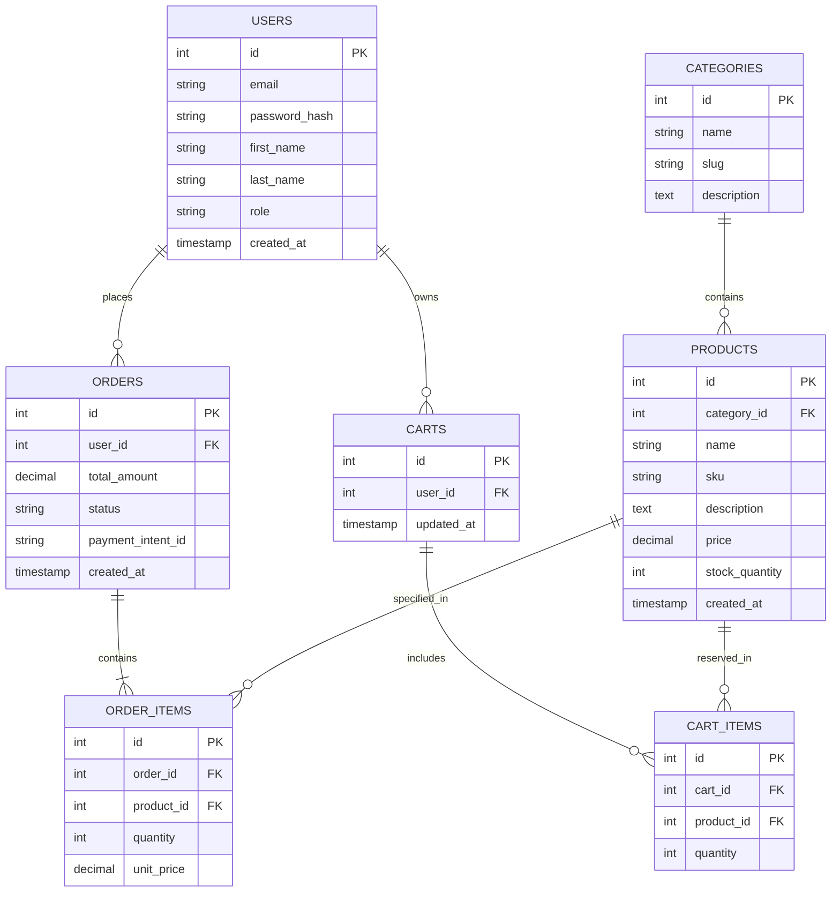

**Project:** TechSphere - An Online Storefront for Consumer Electronics & Accessories
**Course:** E-Commerce

Sprint 1 Architecture & Domain Model Specification:

Section 1: Target Audience & Market Focus:

1.1 Primary User Persona:
Persona Profile: Alex Chen (Tech-Savvy Direct-to-Consumer Shopper)
Demographic: Working professionals aged 22–40 seeking high-performance consumer electronics and modern tech accessories.
Technical Proficiency: High. Expects instantaneous search responses, low latency, seamless dynamic cart updates, and robust account security protocols.
Behavioral Attributes: Prefers streamlined multi-device shopping, guest-to-account checkout transitions, transparent stock status, and real-time transaction receipts.

1.2 Core Operational Pain Point:
Modern e-commerce shoppers frequently experience high friction due to slow search indexing, poor inventory synchronization (leading to out-of-stock checkouts), sluggish page re-renders, and convoluted authentication workflows. This platform eliminates operational latency through optimized database query structures, token-based state persistence, and responsive decoupled architecture.

1.3 Domain Scope:
Vertical Market: Consumer Electronics & Digital Tech Accessories (Direct-to-Consumer e-Commerce Platform).

Section 2: Minimum Viable Product (MVP) Feature Scope:
The matrix below defines the prioritized core workflows for the platform MVP to be executed within the semester constraints:
Category
Feature Name
Description
Priority
 
Authentication
User Registration & Authentication
Secure user registration, login, and session persistence utilizing Argon2/Bcrypt password hashing and JWT (JSON Web Tokens) with refresh token rotation.
High (MVP)
Catalog
Product List & Multi-Filter Search
Dynamic product catalog rendering featuring keyword search, category taxonomy filtering, price-range facets, and pagination.
High (MVP)
Cart
State Persistent Cart Management
Session and account-linked shopping cart management allowing dynamic addition, quantity adjustment, persistent storage across reloads, and item removal.
High (MVP)
Checkout
Order Processing & Payment Integration
Transactional order creation workflow integrated with Stripe API (mock/test mode) to process payments, update inventory, and generate immutable order receipts.
High (MVP)
Admin
Inventory & Product Management
Role-based administrative portal executing complete CRUD (Create, Read, Update, Delete) operations on products, category definitions, and stock levels.
Medium

Section 3: Tech Stack Selection & Justification:

3.1 Frontend Framework: React.js (TypeScript)
Justification: React's component-based virtual DOM architecture provides highly efficient state rendering for dynamic interfaces like shopping carts and filtered product catalogs. TypeScript enforces strict client-side type safety, reducing runtime errors. React offers superior community support and modular ecosystem integrations compared to Vue.js or traditional multi-page setups.

3.2 Backend Infrastructure: Node.js with Express.js
Justification: Node.js delivers non-blocking, event-driven asynchronous I/O performance perfectly tailored for handling concurrent e-commerce requests (such as simultaneous cart updates and catalog queries). Express provides a lightweight, highly customizable framework for architecting RESTful APIs. Compared to Django or Spring Boot, it allows seamless JavaScript/TypeScript full-stack execution, minimizing development friction.

3.3 Database Management System: PostgreSQL
Justification: E-commerce transactions require strict ACID compliance, robust referential integrity, and relational dynamic query support to ensure accurate order handling and inventory consistency. PostgreSQL excels over non-relational databases like MongoDB by preventing orphaned records and dirty reads during simultaneous user checkouts. Its rich data-type support (e.g., DECIMAL, TIMESTAMP WITH TIME ZONE) aligns directly with structural requirements.

3.4 Caching & Session Store: Redis
Justification: Redis is implemented as an in-memory key-value data store to handle high-performance session persistence, temporary guest cart caching, and rate limiting. Offloading temporary state reads from PostgreSQL to Redis significantly lowers database load and improves API response times under high request volumes.

Section 4: Entity-Relationship Diagram (ERD)

4.1 Relational Architecture Diagram (Mermaid.js):

4.2 Relational Schema & Cardinality Specifications:
USERS to ORDERS (1 : N): One user can place zero or many orders. Each order belongs exclusively to one user. (FK: ORDERS.user_id → USERS.id).
USERS to CARTS (1 : 1): One user owns at most one active cart. (FK: CARTS.user_id → USERS.id).
CATEGORIES to PRODUCTS (1 : N): One category contains zero or many products. Each product maps to one primary category. (FK: PRODUCTS.category_id → CATEGORIES.id).
CARTS to CART_ITEMS (1 : N) & PRODUCTS to CART_ITEMS (1 : N): Associative relationship resolving Many-to-Many mapping between Carts and Products. (FKs: CART_ITEMS.cart_id → CARTS.id, CART_ITEMS.product_id → PRODUCTS.id).
ORDERS to ORDER_ITEMS (1 : N) & PRODUCTS to ORDER_ITEMS (1 : N): Associative entity recording exact historic pricing and line items for completed orders. (FKs: ORDER_ITEMS.order_id → ORDERS.id, ORDER_ITEMS.product_id → PRODUCTS.id).
